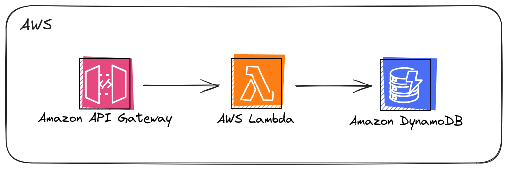

# Amazon API Gateway to AWS Lambda to Amazon DocumentDB

This project was inspired by resources from [Serverless Land](https://serverlessland.com). For the official documentation, please visit [this link](https://serverlessland.com/patterns/apigw-http-lambda-documentdb-cdk).

## Architecture

This AWS CDK stack deploys an API Gateway HTTP API that integrates with a Lambda function and a DocumentDB cluster. The Lambda function is configured to use a customer VPC to connect to the DocumentDB cluster. The Lambda function implements CRUD operations on the database. The diagram below represents the architecture for this pattern:

  

