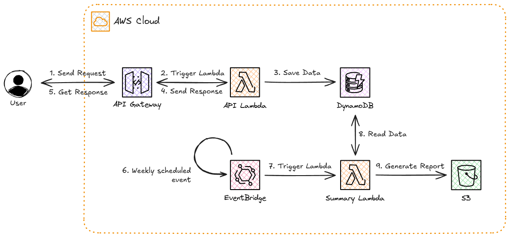

# Scheduled Data Summary Export

This pattern shows how to set up a serverless data pipeline with AWS CDK. It provides an API endpoint for sending in JSON data, which is then persisted to a datastore (DynamoDB in the following example). In addiction, there’s a scheduled process that runs every week to create a summary file with the total number of items in the datastore, which is automatically saved to an S3 bucket.

## Getting Started

In addition to the basic AWS tools, the following dependencies are needed to work with this project:

- [uv](https://docs.astral.sh/uv/) - extremely fast Python package and project manager, written in Rust

### Deployment

Follow these steps to get the project up and running:

1. **Create a new Python project with uv**
   ```
   uv init
   ```

2. **Initialize the virtual environment with uv**
   ```
   uv venv
   ```

3. **Activate the virtual environment**
   ```
   source .venv/bin/activate
   ```

4. **Build the Lambda functions using the Makefile**
   ```
   make HANDLER=api
   make HANDLER=summary
   ```

5. **Deploy the infrastructure with CDK**
   ```
   cdk deploy
   ```

## Architecture

The following architecture brings together several AWS services to create the application described above:

<p align="center">
  
</p>

The main components of this architecture are:

- API Gateway (LambdaRestAPI) - While HTTP API is great for lightweight, low-latency use cases, with cost benefits, LambdaRestAPI offers more flexibility and control for building production-ready APIs, with features like request/response transformations, comprehensive throttling controls or API keys
- EventBridge - when used with Lambda functions, it offers a good balance between simplicity, cost, and ease of maintenance. Step Functions are great for handling more complex, multi-step workflows, but for simple tasks, they can add extra overhead and cost. With EventBridge, you get a straightforward way to trigger your functions directly
- DynamoDB - Unlike other alternatives (Aurora/RDS), it does not require persistent connections, connection management, and VPC networking setup, while offering autoscaling, automatic backup and replication features, eliminating operational overhead
- Lambda Functions - Easy code execution in response of events
- S3 Bucket - Simple and reliable storage solution for reports

### Additional Implementation Considerations

- The process of automatically building Lambda functions using bundling images was not implemented for simplicity
- The API handler Lambda function is designed to handle additional events, with logic to identify the HTTP method and target resource
- The API Gateway includes a request validator, in addition to Lambda-level validation, to ensure data consistency. Method responses are also explicitly defined at the API Gateway level, providing an extra layer of consistency and ensuring that the API delivers predictable responses for each call

## CI/CD Integration

Implementing a CI/CD solution for this setup would require to follow a number of steps that automatically build, test and deploy the infrastructure, when pushing the code into the repository. Therefore, using GitHub Actions as a use case, it would be necessary to configure the workflow to:

1. Checkout the code
2. Setup AWS tools (CLI, CDK), Python and account credentials (using repository secrets)
    - Ensure an AWS IAM role with the necessary permissions is available for pipeline execution, and configure your workflow to assume this role for secure deployments
    - On multi stage deployments, is is also necessary to provide the information for the target accounts, such as account names. Consistent role identifications can optimize the automation of the multi-account deployment
3. Run tests
    - Optionally, run linting and formatting for code quality and consistency
4. Run `cdk synth` to validate the CloudFormation stack. This step helps catch errors early and prevents failures during, deployment processes, specially long ones
    - Optionally, run `cdk diff`, for a detailed summary of infrastructure changes, publishing them to the task summary
5. Deploy infrastructure

## References

- [Building Lambda functions with Python](https://docs.aws.amazon.com/lambda/latest/dg/lambda-python.html)
- [Lambda examples using SDK for Python (Boto3)](https://docs.aws.amazon.com/code-library/latest/ug/python_3_lambda_code_examples.html)
- [Programming Amazon DynamoDB with Python and Boto3](https://docs.aws.amazon.com/amazondynamodb/latest/developerguide/programming-with-python.html)

## Useful commands

 * `cdk ls`          list all stacks in the app
 * `cdk synth`       emits the synthesized CloudFormation template
 * `cdk deploy`      deploy this stack to your default AWS account/region
 * `cdk diff`        compare deployed stack with current state
 * `cdk docs`        open CDK documentation

Enjoy!
